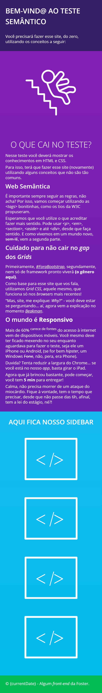
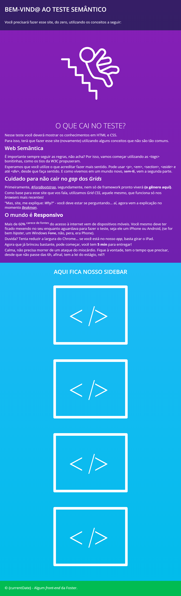
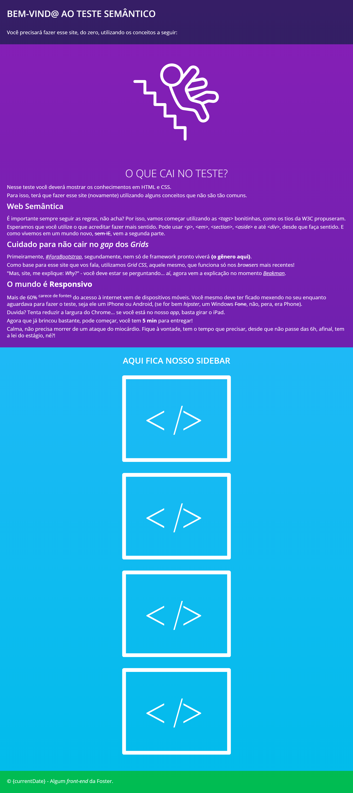
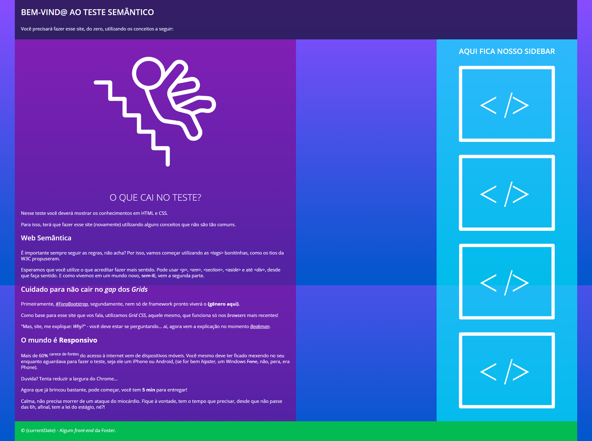

# TestDrive

Teste e treinamento HTML para novos programadores

## Informações iniciais

### Cores:

- _background:_ #884CFF, #0057CC

- _header:_ #000

- _main:_ #870087

- _sidebar:_ #0FFF

- _footer:_ #0FF0

### Fonte

- 'Open Sans'

### Texto

- [Textos](_doc/templates/texto.txt)

### Imagens

- [Placeholder](_doc/templates/placeholder.svg)

- [Escada](_doc/templates/falling-down.svg)

### Protótipos

Mobile

Tablet __(Portrait)__

Tablet __(Landscape)__

Desktop

#### macOS

- [Instalador .dmg](_doc/install/fase-1/Test Drive-0.0.1.dmg.zip)

- [Instalador .app](_doc/install/fase-1/Test Drive.app.zip)

#### Windows

- [Instalador .exe](_doc/nstall/fase-1/Test Drive Setup 0.0.1.exe)

## Requisitos

### Essencial

- Web Semântica;

- Boas práticas;

- Metodologia de Responsividade;

- Tempo gasto;

- Atenção aos detalhes;

- __Não haverá ajuda__;

- Proximidade com o solicitado.

### Não precisa fazer, mas se fizer é ponto extra

- Animação de texto via JavaScript.

## Pontos extras

- Enumerar _easter eggs_ presentes no protótipo.

## Duração do Teste

- __Mínimo:__ 1h;

- __Tempo médio:__ 3h;

- __Máximo:__ 6h.

## Nota Final:

- De 1 a 10.
